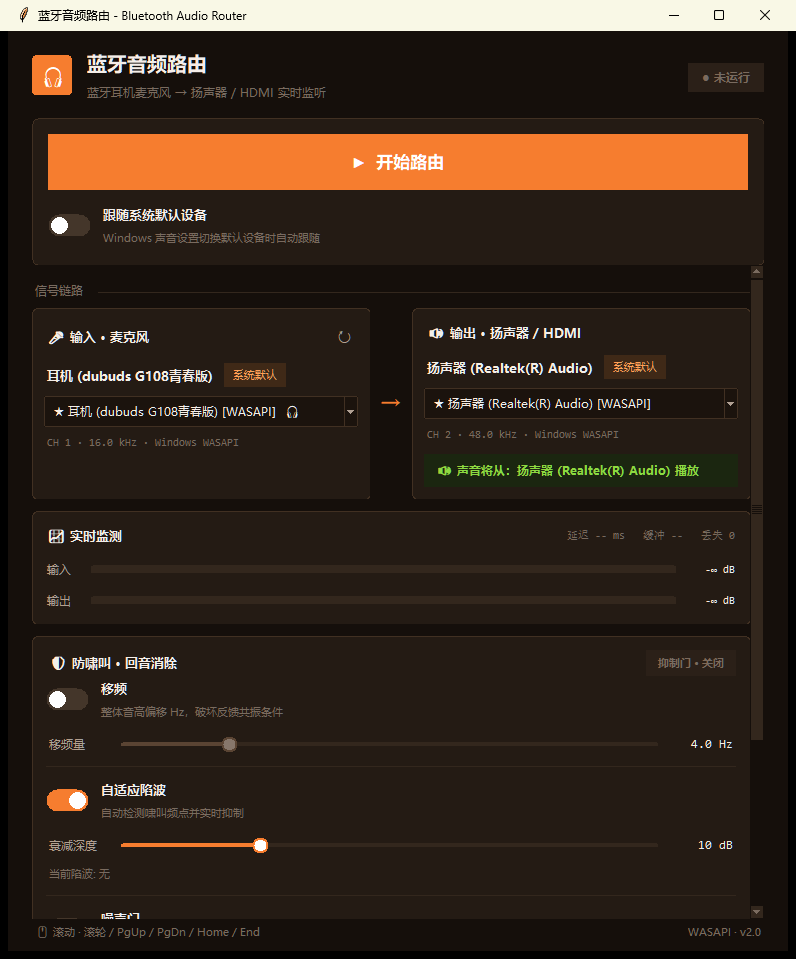

<div align="center">

# Bluetooth_Mic_Speaker

**把你的蓝牙耳机变成一支无线麦克风 —— 声音实时从电脑音响 / HDMI 播出。**

Windows 本地实时音频路由工具 · 蓝牙耳机麦克风 →（防啸叫处理）→ 扬声器 / HDMI

[](https://www.python.org/)
[](#系统要求)
[](LICENSE)
[](#技术栈)
[](https://github.com/faithxie/Bluetooch_Mic_Speacker/releases/latest)

**▶ [点此下载最新版 BTSPK.exe](https://github.com/faithxie/Bluetooch_Mic_Speacker/releases/latest)** —— 免安装，双击即用

</div>

---

## 这是什么？

一款 Windows 上的**实时音频路由**小工具。它把**蓝牙耳机麦克风**采集到的声音，经过防啸叫处理后，**实时**送到电脑的扬声器、音响或 HDMI/电视上播放。

换句话说：**戴着蓝牙耳机说话，声音从房间的音响里出来。**

```
   🎧 蓝牙耳机麦克风  ──►  防啸叫处理链  ──►  🔊 扬声器 / 📺 HDMI 电视
        (你的声音)          (陷波+移频)         (放大的声音)
```

### 典型场景

| 场景 | 怎么用 |
|------|--------|
| **演讲 / 培训** | 蓝牙耳机当无线麦，声音从会场音响输出，人可以在台上自由走动 |
| **语音教学** | 老师戴蓝牙耳机讲课，声音从教室音响播出，不用手持麦克风 |
| **K 歌 / 直播** | 实时耳返监听自己的声音 |
| **会议 / 导览** | 小房间扩音，避免手持麦克风的线材束缚 |
| **HDMI 输出** | 把声音送到电视 / 投影 / 显示器自带的音箱 |

### 为什么需要专门的软件？

Windows 本身**不提供**「麦克风 → 扬声器」的实时直通 —— 系统只会把麦克风用于录音，不会回放到输出设备。而且一旦你手动做直通，就会立刻遇到两个现实问题：

1. **啸叫（声反馈）** —— 扬声器的声音被麦克风再次拾取、放大、再播出，形成正反馈，几十毫秒内就能啸叫到刺耳的高频尖叫。
2. **蓝牙耳机的麦克风很小、音量偏低**，直接直通往往听不清。

本项目就是为这两个问题而做的：**一键完成路由，并内置四级防啸叫处理**。

---

## 特性

**核心**
- 🔀 任意输入设备 → 任意输出设备的实时路由
- 🎛️ **四级防啸叫**：多判据检测 + 自适应陷波 + 真移频 + 噪声门
- 📺 **HDMI / 显示器音频支持**（自动识别「显示器音频」这类不叫 HDMI 的设备）
- 🎧 蓝牙耳机麦克风优先识别（含 HFP 免提模式）
- 🎚️ 麦克风增益 0–500%、输出音量 0–200%
- 🎼 自动采样率转换（如蓝牙 16 kHz → 扬声器 48 kHz）与单声道→立体声扩展

**工程细节**
- 输入/输出**独立双流**架构，抖动互不影响
- 样本级环形缓冲，约 500 ms 抗抖动余量
- Host API 优先级（**WASAPI** 优先，排除不支持回调的 WDM-KS / ASIO）
- 设备**可用性预检测**（真的打开一次流，避免选中打不开的设备）
- 启动参数**自动容错**（自动尝试多种参数组合）
- 实时电平表 + 延迟/缓冲/欠载监控
- 输出设备**偏好记忆**（手动选一次，下次自动恢复）

---

## 快速开始

### 系统要求

- **Windows 10 / 11**
- **Python 3.10+**（需勾选 `tcl/tk and IDLE` 组件，否则 Tkinter 不可用）
- 一个蓝牙耳机（提供麦克风）、以及任意扬声器 / HDMI 输出设备

### 安装

```bash
git clone https://github.com/<your-name>/Bluetooth_Mic_Speaker.git
cd Bluetooth_Mic_Speaker

# 创建虚拟环境
python -m venv venv
venv\Scripts\python.exe -m pip install -r requirements.txt
```

### 运行

双击 `start.bat`，或：

```bash
venv\Scripts\python.exe main.py
```

### 打包为 EXE（免安装分发）

不想在目标电脑上装 Python？双击 `build_exe.bat` 一键打包，或手动执行：

```bash
venv\Scripts\python.exe -m PyInstaller --noconfirm --clean build_exe.spec
```

产物为 **`dist\BTSPK.exe`**（单文件，约 53 MB），复制到任意 Windows 10/11 电脑双击即可运行。

打包细节：

| 事项 | 说明 |
|---|---|
| 打包配置 | `build_exe.spec`（onefile + windowed，不弹黑框） |
| PortAudio DLL | 经本地 `hooks/hook-sounddevice.py` 只收 win64 变体，剔除 mac/arm/32bit 冗余 |
| 设备偏好 | 打包后写入 `%APPDATA%\BTSPK\.device_prefs.json`（源码运行仍写项目根目录） |
| 运行日志 | `%APPDATA%\BTSPK\BTSPK.log`，启动失败时会有弹窗提示 |
| 启动速度 | onefile 首次启动需解包，约 1~3 秒；如需更快把 spec 里 `ONE_FILE = False` 改为目录版 |

### 直接下载

不想自己打包？到 [**Releases**](https://github.com/faithxie/Bluetooch_Mic_Speacker/releases/latest) 页面下载最新的 `BTSPK.exe`，双击即用。

### 发布 Release（维护者）

把 `dist\BTSPK.exe` 一键发到 GitHub Releases，无需安装 `gh` CLI：

```bash
venv\Scripts\python.exe release.py            # 版本号自动 +1（补丁位）
venv\Scripts\python.exe release.py v1.1.0     # 指定版本号
venv\Scripts\python.exe release.py v1.1.0 --draft        # 先存草稿
venv\Scripts\python.exe release.py v1.1.0 --notes 说明.md  # 自定义发布说明
```

脚本会自动：打 tag → 建 Release → 上传 exe 附件，并生成带 SHA256 校验值的默认发布说明。

| 事项 | 说明 |
|---|---|
| 凭据 | 通过 `git credential fill` 读 Windows 凭据管理器，**不落盘**；只要能 `git push` 就能用 |
| 幂等 | tag / Release / 同名附件已存在时会复用或覆盖，可安全重跑 |
| 网络 | 默认**直连**，绕过本地代理（代理转发大文件上传会返回 502 Bad Gateway） |
| 失败重试 | 所有 API 调用内置指数退避重试，网络抖动可自愈 |

### 使用步骤

1. **输入设备**：选你的蓝牙耳机麦克风（带 🎧 标记，程序会自动优先选中）
2. **输出设备**：选你要外放的音响（带 📺 标记的是 HDMI / 显示器音频）
3. 调节**麦克风增益**（蓝牙耳机麦克风通常需要 +100%~200%）和**输出音量**
4. 点 **启动**
5. 如果出现啸叫，按下面的「防啸叫调参」章节处理

> 💡 **降低啸叫最有效的办法是物理层面**：让麦克风远离扬声器、降低扬声器音量、或者把麦克风朝向背对扬声器。软件算法只是兜底。

---

## 界面

深色主题，**上固定 + 中滚动 + 下提示**三段式布局，信号链路一目了然。

<div align="center">
  
</div>

| 区域 | 内容 |
|------|------|
| 顶栏 | 品牌标识 + 运行状态胶囊（`● 运行中` / `● 未运行`） |
| 固定控制区 | ▶ 开始路由 / 停止 大按钮、「跟随系统默认设备」开关 |
| 信号链路 | 输入·麦克风 与 输出·扬声器/HDMI 双卡片：设备下拉、采样率 · Host API 信息、`🔊 声音将从：… 播放` 提示条 |
| 实时监测 | 输入/输出渐变电平表（绿→黄→红 + 峰值保持）、延迟 / 缓冲 / 丢帧指标 |
| 防啸叫·回音消除 | 移频开关与移频量（Hz）、自适应陷波开关与陷波深度（dB）、当前陷波频率实时显示 |
| 底部 | 滚动操作提示（滚轮 / PgUp / PgDn / Home / End）与引擎版本 |

> 界面随设计稿重制：输入 / 输出卡片左右并列直观呈现路由方向；防啸叫参数按重要性排布，开关与滑杆联动禁用。

---

## 防啸叫原理

啸叫的本质是**正反馈**：声音从扬声器出来 → 被麦克风拾取 → 放大 → 再播出，当**环路增益 ≥ 1** 且**相位恰好对齐（0°/360°）**时，就会在某个频率上自激振荡，几十毫秒内飙升成刺耳尖叫。

本项目用**四道防线**，每道针对反馈环的不同环节：

```
麦克风 ──► ①噪声门 ──► ②侧链抑制 ──► 增益/重采样 ──► 环形缓冲
                                                        │
                                                        ▼
扬声器 ◄────────── ④移频 ◄────────── ③自适应陷波 ◄──────┘
```

| 防线 | 作用 | 针对 |
|------|------|------|
| **① 噪声门** | 不说话时静音，直接切断环路 | 静默期起振 |
| **② 侧链抑制** | 扬声器有声时压低麦克风增益 | 降低环路增益 |
| **③ 自适应陷波** | 检测到啸叫频率后精准挖掉该窄带 | 已形成的单频啸叫 |
| **④ 真移频** | 把频谱整体搬移几 Hz，破坏相位对齐条件 | 根本性地打断自激 |

### 关于「移频」的关键实现

早期版本用的「移频」实际上只是**延迟调制（颤音 / FM）**，实测 1000 Hz 输入主峰**仍然在 1000 Hz**，只能产生 ±4 Hz 边带，抑制效果有限。

现在改为**真正的单边带移频**（SSB，基于 FIR Hilbert 变换器，63 抽头），实测：

| 输入 | 输出主峰 | 误差 |
|------|---------|------|
| 1000 Hz | **1004.00 Hz** | 0.00 Hz |

真正把频率搬移了，才能持续破坏 0°/360° 的相位对齐点。

### 关于「多判据检测」

陷波器的难点是**区分啸叫和人声**。因为元音（a/e/i/o/u）也是窄带谐波，用单一判据（比如「比邻近频点高 6 dB」）会把人声的共振峰一起挖掉 —— 结果就是**说话声音变调了**。

本项目采用**多判据同时成立**才判定为啸叫（van Waterschoot & Moonen, *Proc. IEEE* 2011 的方法论）：

| 判据 | 含义 | 阈值 |
|------|------|------|
| **PHPR** | 峰值-谐波功率比 | > 40.0 |
| **PNPR** | 峰值-邻域功率比 | > 9.0 |
| **IMSD** | 帧间频谱不相似度 | < 1.0 |
| **PTPR** | 峰值-总功率比 | > −45.0 |

核心洞察：**人声有谐波家族（基频+泛音），啸叫没有**。所以「是否是孤立窄带峰」能把两者分开。

实测效果：

| 指标 | 修复前 | 修复后 |
|------|--------|--------|
| 语音误触发（187 帧） | 66 次误判 | **0 次** |
| 啸叫检出 | — | 180 / 187 帧 |
| 啸叫 RMS | 0.0457 | **0.0029（−24 dB）** |

### 防啸叫调参

默认参数是**保守**的（尽量不损伤人声），可以根据实际情况调整：

| 症状 | 调整 |
|------|------|
| 仍有轻微啸叫 | 打开 **移频**（4 Hz），或提高**陷波衰减**（默认 10 dB，可到 30 dB） |
| 声音发闷 / 变调 | 降低**陷波衰减**，关闭**侧链抑制** |
| 说话间隙有回音 | 打开**噪声门** |
| 增益加不上去 | 先关噪声门和侧链，它们会压制增益 |

> ⚠️ **最佳实践**：先解决物理问题（麦克风离扬声器远一点、朝向背对、降低音量），再从软件上微调。软件无法突破物理定律。

---

## 项目结构

```
Bluetooth_Mic_Speaker/
├── main.py                         # 程序入口
├── start.bat                       # Windows 启动脚本
├── requirements.txt
├── README.md
├── LICENSE
│
├── audio_router/                   # 主程序包
│   ├── models/
│   │   └── audio_device.py         # 设备信息模型（类型识别：蓝牙/HDMI/虚拟）
│   ├── services/
│   │   ├── device_manager.py       # 设备枚举、可用性检测、优先级排序
│   │   ├── audio_router.py         # 核心路由引擎（双流 + 环形缓冲）
│   │   ├── howling_suppressor_v2.py# 防啸叫算法：真移频 + 多判据检测
│   │   └── feedback_suppressor_deprecated.py  # 【已废弃】旧算法，留作记录
│   └── ui/
│       └── main_window.py          # Tkinter 三段式界面
│
├── diagnostics/                    # 诊断与验证脚本
│   ├── README.md
│   ├── test_chain_e2e.py           # 端到端链路测试
│   ├── debug_shifter.py            # 移频器验证（单音探针）
│   ├── debug_v2.py                 # 多判据检测调试
│   ├── diag_howling.py             # 啸叫诊断
│   ├── diag_deep.py                # 深度分析
│   └── diag_validate_fix.py        # 修复效果验证
│
├── aec_experiment/                 # 【探索性】AEC 可行性验证（结论：不采用）
│   ├── AEC验证报告.md               # 完整报告与实测数据
│   ├── aec_onnx_runner.py          # 纯 Python 流式 ONNX 运行器
│   ├── aec_controlled_probe.py     # 受控验证脚本
│   └── capture_speech.py           # 经虚拟声卡录制真实语音
│
├── 产品分析与技术总结.md              # 架构、技术选型、竞品对比
└── 啸叫问题诊断与解决方案报告.md        # 啸叫问题的完整诊断与实测数据
```

---

## 技术栈

| 类别 | 选型 | 说明 |
|------|------|------|
| 语言 | Python 3.10+ | |
| 音频 I/O | **PortAudio** (via `sounddevice`) | 支持 WASAPI 低延迟回调 |
| 数值计算 | NumPy | 信号处理 |
| 信号处理 | SciPy | 重采样、滤波器设计 |
| GUI | **Tkinter** (ttk) | Python 自带，零额外依赖，启动快 |
| 测试（可选） | onnxruntime | 仅 AEC 实验用 |

### Windows 上的 Host API 选择

PortAudio 在 Windows 提供多个后端，可靠性差别很大：

| API | 优先级 | 说明 |
|-----|--------|------|
| **WASAPI** | ⭐⭐⭐ | 最可靠，延迟低，支持回调 |
| DirectSound | ⭐⭐ | 兼容性好，延迟中等 |
| MME | ⭐ | 最老，延迟高但兼容性最好 |
| WDM-KS | ❌ 排除 | 只支持阻塞模式，不支持回调 |
| ASIO | ❌ 排除 | 专业声卡专用，普通设备不支持 |

程序会自动按此优先级排序设备，并**实际尝试打开一次流**来验证可用性。

---

## AEC 方案评估（已否决）

调研 [MicYou](https://github.com/LanRhyme/MicYou) 时发现其依赖 [lightweight-aec-48k](https://github.com/a2heng/lightweight-aec-48k)（MIT，48 kHz 流式声学回声消除）。当时设想：用即将输出的数据作为「远端参考」，让 AEC 从源头减掉扬声器漏音，比陷波/移频更根本。

于是做了独立验证。**结论：该模型不适合本场景，未采用。**

决定性的一个数据（固定回声 −12 dB、延迟 30 ms，只改近端人声电平）：

| 近端 / 回声比 | ERLE（回声抑制） |
|---|---|
| −60 dB（无近端人声） | 35.3 dB |
| −20 dB | 14.3 dB |
| **0 dB（等强）** | **0.12 dB** |
| +6 dB | **−4.2 dB**（回声反而被放大） |

同参数下 mic 里只有回声时 ERLE 达 64 dB，**一旦叠上人声立刻掉到 0.12 dB**。

原因是该模型内置**双讲检测保护**（宁放过回声、不削本地人声）——这是业界标准做法，但对本场景是致命的：麦克风里必然同时有用户说话声和扬声器漏音，两者物理上无法分离；而且「用户说话」与「啸叫最易建立」在时间上是**错开**的，模型恰好在最需要它的时候关闭。

另有次要门槛：参考信号须**领先回声 ≥ 20 ms** 才有效（该模型按网络回声 >100 ms 训练，1–5 ms 落在其训练分布外）；且它只在「不像人声」的信号上工作（白噪声 27.5 dB，而 300–3400 Hz 带限噪声仅 1.1 dB，真实语音 0.0 dB）。

**副产品**：过程中写的纯 Python ONNX 流式运行器 `aec_onnx_runner.py` 是可复用的，并修正了上游三个实现问题（详见 [AEC验证报告](aec_experiment/AEC验证报告.md)）：

1. 输出张量**必须按名字映射**而非位置（第 6 个输出 `deep_enc_conv_o` 是 `(1,0)` 的死张量，无对应输入）
2. 合成端**必须用 WOLA**（sqrt-Hann 满足 `w[k]² + w[k+480]² = 1`，正确重叠相加可获相关性 1.000000 的精确重建；上游取半窗会恒定损失 −3.00 dB）
3. 输出天然滞后两跳（960 采样），需在流式封装中补偿

**对现有方案的影响**：无需改动。反而印证了当前设计的合理性 —— **移频不能去掉**，因为它处理的是相位条件，且对非线性环节（扬声器削顶、功放饱和、蓝牙编解码）依然有效，而线性自适应 AEC 对非线性无能为力；**多判据检测的价值也被凸显**，它能在混有语音时识别啸叫，正是 AEC 双讲检测主动放弃的工作。

---

## 故障排查

| 现象 | 原因与解决 |
|------|-----------|
| **啸叫** | 先降低扬声器音量、让麦克风远离并背对扬声器；再开移频 / 提高陷波衰减 |
| **声音发闷、变调** | 降低陷波衰减；关闭侧链抑制；把输入增益调回 100% 附近 |
| **听不到声音** | 检查输出设备是否选对；蓝牙耳机需确认处于 A2DP（立体声）而非 HFP 模式 |
| **输出到电视没声音** | 选带 📺 标记的设备（名称多为「显示器音频」，不含 HDMI 字样）；或把电视设为系统默认播放设备 |
| **有断续 / 爆音** | 蓝牙链路不稳，或缓冲不足；关掉其他占用音频的程序 |
| **`No module named tkinter`** | 重装 Python 并勾选 `tcl/tk and IDLE` |
| **找不到蓝牙耳机** | 先在 Windows 设置里连上耳机（需要 HFP 免提模式提供麦克风）；然后重启程序 |
| **延迟偏大** | 蓝牙本身有 100–200 ms 延迟，属正常；有线麦克风可显著降低 |

---

## 已知限制

- **仅 Windows**：深度依赖 WASAPI 与 Windows 蓝牙协议栈，未适配 macOS / Linux
- **蓝牙延迟**：A2DP 链路本身有 100–200 ms 延迟，实时监听场景可感知
- **单声道输入**：蓝牙耳机麦克风通常是单声道，会自动复制到立体声输出
- **非线性啸叫**：软件算法对扬声器削顶等非线性反馈只能抑制，不能根除
- **Tkinter 界面**：功能优先，视觉朴素

---

## 开发说明

### 运行诊断脚本

`diagnostics/` 下是可以独立运行的验证脚本，用于排查啸叫算法问题：

```bash
venv\Scripts\python.exe diagnostics\test_chain_e2e.py     # 端到端链路
venv\Scripts\python.exe diagnostics\debug_shifter.py      # 移频器（单音探针）
venv\Scripts\python.exe diagnostics\diag_howling.py       # 啸叫诊断
```

> 这些脚本都会把项目根目录注入 `sys.path`，可任意位置运行。

### 一个调试经验

`test_chain_e2e.py` 早期用**宽带语音的频谱质心**来衡量移频效果，结果读出 `+1251.8 Hz` 的荒谬数值。原因是宽带信号的质心对时间对齐极其敏感。后来改用**单音探针**（1000 Hz → 1004.00 Hz，误差 0.00 Hz），结论才稳定可靠。

**教训：验证 DSP 请用单音或已知信号，不要用宽带自然信号的统计量。**

---

## 许可

[MIT](LICENSE)

## 致谢

- [PortAudio](https://www.portaudio.com/) / [python-sounddevice](https://github.com/spatialaudio/python-sounddevice) —— 跨平台音频 I/O
- [van Waterschoot & Moonen, *Fifty Years of Acoustic Feedback Control*, Proc. IEEE 2011](https://ieeexplore.ieee.org/document/5713215) —— 多判据啸叫检测的方法论依据
- [a2heng/lightweight-aec-48k](https://github.com/a2heng/lightweight-aec-48k) —— AEC 验证所用模型（MIT；评估后未采用，见上文）

---

<div align="center">

**如果这个项目对你有帮助，欢迎点个 ⭐ Star**

</div>
